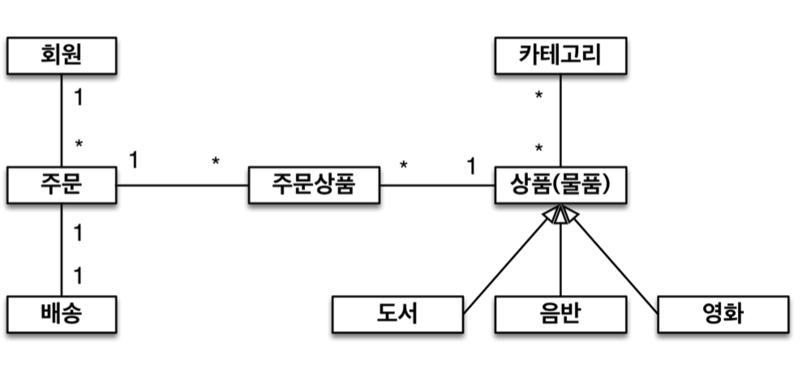
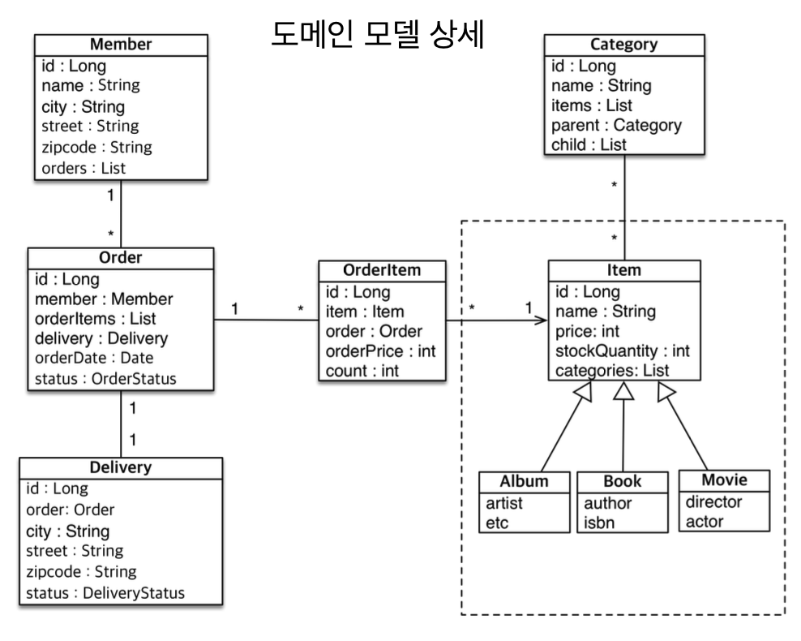
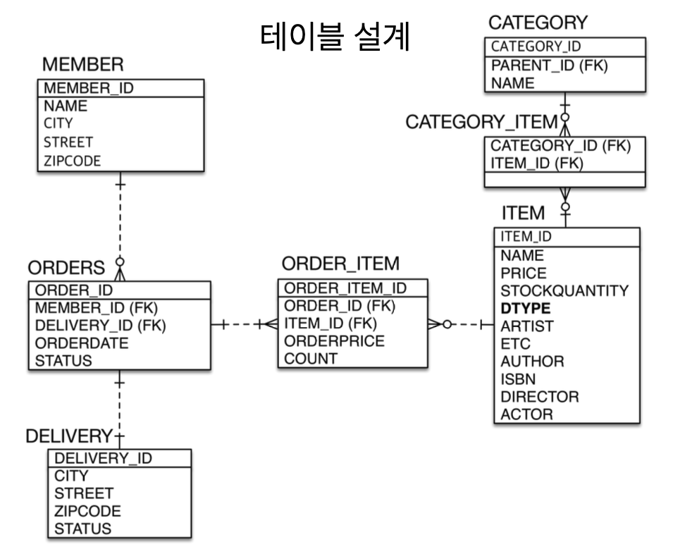

# 실전예제

## 요구사항

- 상품의 종류는 음반,도서,영화가 있고 추후 더 추가될 수 있다.
- 모든 데이터는 등록일과 수정일이 필수다.

## 설계

### 도메인

### 도메인 상세

### 테이블

## 실제 작성

### 각 도메인 클래스 생성

- 도메인 별 클래스 우선 생성
- 멤버 속성 부여

### 관계 설정

- ITEMS SINGLE TABLE
  - ITEM 테이블의 경우, Single Table 전략으로 생성.
  - DTYPE 설정까지 진행.
  - **abstart** 추상 클래스로 설정하는 것 잊지 말기!

- @MappedSuperClass
  - InfoHistory 라는 이름으로 공통으로 들어갈 등록일/수정일을 추가.
  - 이후, 상속 받는 것을 전부 추가

- 관계
  - 다대일, 다대다 의 경우 도메인 모델 상세에서 어디가 '다' 인지 확인 후, 해당 클래스에 @ManyTo... 를 추가.

### 개선

- @ManyToMany를 사용할 때는 @JoinColumn 이 아니라 @MappedBy 를 사용한다.
- 
